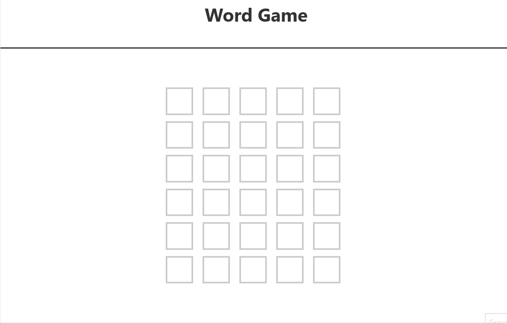

# Word Game 🔠

This is the Word Game, a word-guessing game influenced by [Wordle](https://www.nytimes.com/games/wordle/index.html) from The New York Times.

## Functionalities
- **Secret Word:** There is a secret five-letter word chosen.
- **Guesses:** Players have six guesses to figure out the secret word. After six guesses, they lose.
- **Correct Guesses:** If the player guesses a letter that is in the right place, it is shown as green.
- **Incorrect Position Guesses:** If the player guesses a letter that is in the word but not in the right place, it is shown as yellow.
- **Multiple Occurrences:** It accounts for however many of the letters exist in the word. For example, if the player guesses "SPOOL" and the word is "OVERT," one "O" is shown as yellow, and the second one is not.
- **Winning:** If the player guesses the right word, the player wins, and the game is over.

## Overview

